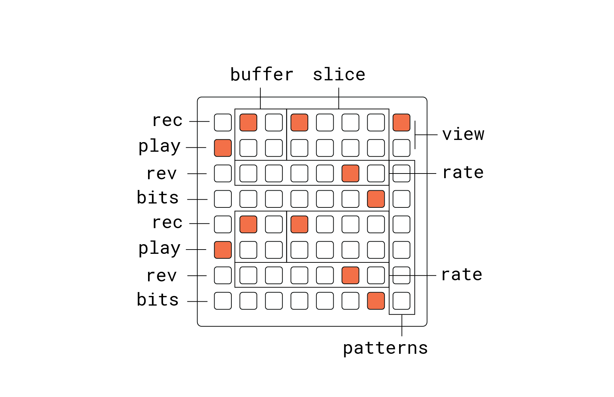

# gravl

dual data pavement

## grid

## norns

- **E1:** overdub
- **E2:** start
- **E3:** length
- **K2:** randomize start
- **K3:** randomize length

## notes

crow + arc
- crow
  - outputs: two voltages stored in each slice
  - inputs: set slice index for each voice
- arc
  - 1: start
  - 2: length
  - 3: volt 1
  - 4: volt 2 
